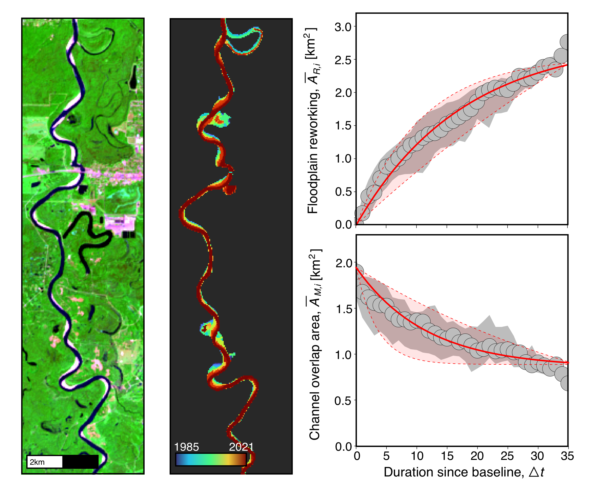

# CalculateMobility 
CalculateMobility is a software package to quantify river channel mobility using an area-based framework developed for channel mask timeseries.



## Dependencies
* Python version=3.10
* GDAL (can be installed via conda)
* numpy 
* pandas 
* natsort 
* rasterio 
* pyproj 
* pillow 
* matplotlib 
* scipy 

Dependencies other than GDAL can be installed using the Python Package Installer (pip):

```
pip install -r requirements.txt 
```

## Calculate Mobility 

I run the software from shell. I've included examples of how to run over directory of channel masks and how to run over all of the DSWE water levels (from GEE_watermasks). The scripts requires the directory of watermasks as well as the polygon shapefile the denotes the study area.

Parameters include:

* river - name of the study area/river (also used as name for file storage and file names)
* poly - path to the .gpkg file used to determine the region of interest. Examples of these can be found in the /examples directory
* metrics - this flags whether you want to aggregate all the DSWE water levels and incorporate their uncertainty. Options are "dswe" or "single." "dswe" requires a set directy structure as produced in GEE_watermasks.
* out - base directory where the masks are stored

Example:
river='Indus'
poly="/Shapes/$river.gpkg"
metrics="single"
out="Figures/Indus"
